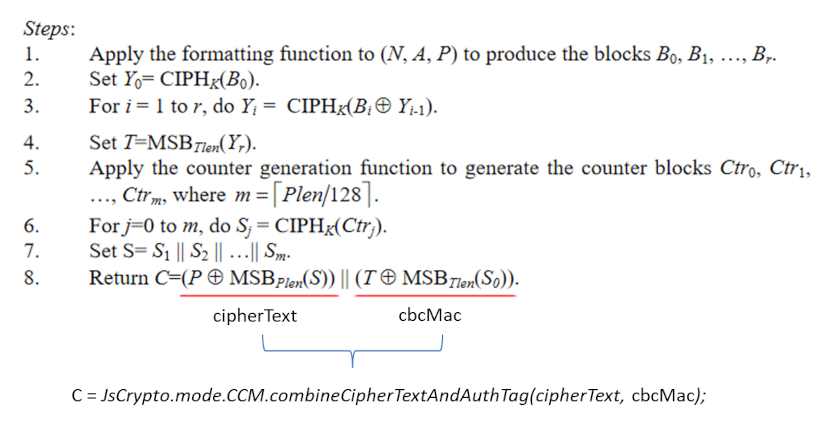

## API
`jscrypto` supports crypto modules as well as `cryptojs`.

### *Popular*
**Hash** [`MD5`][MD5], [`SHA1`][SHA1], [`SHA3`][SHA3], [`SHA224`][SHA224], [`SHA256`][SHA256], [`SHA384`][SHA384], [`SHA512`][SHA512], [`RIPEMD160`][RIPEMD160],  
**Message/Key Hash** [`HMAC-MD5`][HMAC-MD5], [`HMAC-SHA224`][HMAC-SHA224], [`HMAC-SHA256`][HMAC-SHA256], [`HMAC-SHA384`][HMAC-SHA384], [`HMAC-SHA512`][HMAC-SHA512], [`GMAC`][GMAC], [`CBC-MAC`][CBC-MAC]  
**Block Cipher** [`AES`][AES], [`DES`][DES], [`Triple-DES`][Triple-DES]

### *Basic structure*
**Word** [`Word32Array`][Word32Array], [`Word64Array`][Word64Array]  
**Encoder** [`Base64`][Base64], [`Hex`][Hex], [`Latin1`][Latin1], [`Utf8`][Utf8], [`Utf16`][Utf16]

### *Misc*
**Stream Cipher** [`Rabbits`][Rabbits], [`RC4`][RC4], [`RC4Drop`][RC4Drop]  
**Key Derive Function** [`OpenSSLKDF`][OpenSSLKDF], [`EvpKDF`][EvpKDF], [`PBKDF2`][PBKDF2]  
**Block Cipher mode** [`CBC`][CBC], [`CFB`][CFB], [`CTR`][CTR], [`ECB`][ECB], [`OFB`][OFB], [`GCM`][GCM], [`CCM`][CCM]  
**Block Padding** [`AnsiX923`][AnsiX923], [`ISO10126`][ISO10126], [`ISO97971`][ISO97971], [`NoPadding`][NoPadding], [`Pkcs7`][Pkcs7], [`Zero`][Zero]  
**Formatter** [`OpenSSLFormatter`][OpenSSLFormatter]

---

### Hash
#### General
Hash module can take both string/binary word as a hashing target.
```js
JsCrypto.SHA256.hash("string");
// or
var w = new Word32Array([0x61626364]); // Binary representation of "abcd"
JsCrypt.SHA256.hash(w);
// or
// Byte array can be hashed.
// ArrayBuffer | Uint8Array | Int8Array | Uint8ClampedArray | Int16Array | Uint16Array 
// Int32Array | Uint32Array | Float32Array | Float64Array
var w = new Word32Array(typedArray);
JsCrypt.SHA256.hash(w);
```

<h4 id='md5'>MD5</h4>

```js
// MD.hash(string)
// Return value of 'hash' is Word32Array
var hashedWord = JsCrypto.MD5.hash("abc");
hashedWord.toString(); // "900150983cd24fb0d6963f7d28e17f72"
hashedWord.toString(JsCrypto.Hex); // "900150983cd24fb0d6963f7d28e17f72"
hashedWord.toString(JsCrypto.Base64); // "kAFQmDzST7DWlj99KOF/cg=="

// Binary words can be hashed as well.
// binary representation of "abc"
var w = new JsCrypto.Word32Array([0x61626300], 3);
var hashedWord = JsCrypto.MD5.hash(w);
hashedWord.toString(); // "900150983cd24fb0d6963f7d28e17f72"

// binary representation of "abcd"
var w2 = new JsCrypto.Word32Array([0x61626364]);
var hashedWord = JsCrypto.MD5.hash(w2);
hashedWord.toString(); // "e2fc714c4727ee9395f324cd2e7f331f"

// You can do gradual update
var md5 = new JsCrypto.MD5("");
md5.update("a");
md5.update("b");
md5.update("c");
var hashedWord = md5.finalize();
hashedWord.toString(); // The same as Jscrypto.MD5.hash("abc").toString(); "900150983cd24fb0d6963f7d28e17f72"
```

<h4 id='sha1'>SHA1</h4>

```js
// SHA1.hash(string)
var hashedWord = JsCrypto.SHA1.hash("abc"); // Return value of 'hash' is Word32Array
hashedWord.toString(); //  "a9993e364706816aba3e25717850c26c9cd0d89d"
hashedWord.toString(JsCrypto.Hex); // "a9993e364706816aba3e25717850c26c9cd0d89d"
hashedWord.toString(JsCrypto.Base64); // "qZk+NkcGgWq6PiVxeFDCbJzQ2J0="

// Binary words can be hashed as well as MD5. See MD5 example above.
// You can do gradual update as well as MD5. See MD5 example above.
```

<h4 id='sha3'>SHA3</h4>

```js
// SHA3.hash(string)
var hashedWord = JsCrypto.SHA3.hash("abc"); // Return value of 'hash' is Word32Array
hashedWord.toString(); //  "18587dc2ea10...7aa511a9d00bb96"
hashedWord.toString(JsCrypto.Hex); // "18587dc2ea10...7aa511a9d00bb96"
hashedWord.toString(JsCrypto.Base64); // "GFh9wuoQa5oVY...plsZ13qlEanQC7lg=="

// Binary words can be hashed as well as MD5. See MD5 example above.
// You can do gradual update as well as MD5. See MD5 example above.
```

<h4 id='sha224'>SHA224</h4>

```js
// SHA224.hash(string)
var hashedWord = JsCrypto.SHA224.hash("abc"); // Return value of 'hash' is Word32Array
hashedWord.toString(); //  "23097d223405d8228642a477bda255b32aadbce4bda0b3f7e36c9da7"
hashedWord.toString(JsCrypto.Hex); // "23097d223405d8228642a477bda255b32aadbce4bda0b3f7e36c9da7"
hashedWord.toString(JsCrypto.Base64); // "Iwl9IjQF2CKGQqR3vaJVsyqtvOS9oLP342ydpw=="

// Binary words can be hashed as well as MD5. See MD5 example above.
// You can do gradual update as well as MD5. See MD5 example above.
```

<h4 id='sha256'>SHA256</h4>

```js
// SHA256.hash(string)
var hashedWord = JsCrypto.SHA256.hash("abc"); // Return value of 'hash' is Word32Array
hashedWord.toString(); //  "ba7816bf8f01cfea414140de5dae2223b00361a396177a9cb410ff61f20015ad"
hashedWord.toString(JsCrypto.Hex); // "ba7816bf8f01cfea414140de5dae2223b00361a396177a9cb410ff61f20015ad"
hashedWord.toString(JsCrypto.Base64); // "ungWv48Bz+pBQUDeXa4iI7ADYaOWF3qctBD/YfIAFa0="

// Binary words can be hashed as well as MD5. See MD5 example above.
// You can do gradual update as well as MD5. See MD5 example above.
```

<h4 id='sha384'>SHA384</h4>

```js
// SHA384.hash(string)
var hashedWord = JsCrypto.SHA384.hash("abc"); // Return value of 'hash' is Word32Array
hashedWord.toString(); //  "cb00753f45a35...2358baeca134c825a7"
hashedWord.toString(JsCrypto.Hex); // "cb00753f45a35...2358baeca134c825a7"
hashedWord.toString(JsCrypto.Base64); // "ywB1P0WjXou1oD1pm...croefMI1i67KE0yCWn"

// Binary words can be hashed as well as MD5. See MD5 example above.
// You can do gradual update as well as MD5. See MD5 example above.
```

<h4 id='sha512'>SHA512</h4>

```js
// SHA512.hash(string)
var hashedWord = JsCrypto.SHA512.hash("abc"); // Return value of 'hash' is Word32Array
hashedWord.toString(); //  "ddaf35a19361...2a9ac94fa54ca49f"
hashedWord.toString(JsCrypto.Hex); // "ddaf35a19361...2a9ac94fa54ca49f"
hashedWord.toString(JsCrypto.Base64); // "3a81oZNherrMQXNJ...2Q86A4qmslPpUyknw=="

// Binary words can be hashed as well as MD5. See MD5 example above.
// You can do gradual update as well as MD5. See MD5 example above.
```

<h4 id='ripemd160'>RIPEMD160</h4>

```js
// RIPEMD160.hash(string)
var hashedWord = JsCrypto.RIPEMD160.hash("abc"); // Return value of 'hash' is Word32Array
hashedWord.toString(); //  "8eb208f7e05d987a9b044a8e98c6b087f15a0bfc"
hashedWord.toString(JsCrypto.Hex); // "8eb208f7e05d987a9b044a8e98c6b087f15a0bfc"
hashedWord.toString(JsCrypto.Base64); // "jrII9+BdmHqbBEqOmMawh/FaC/w="

// Binary words can be hashed as well as MD5. See MD5 example above.
// You can do gradual update as well as MD5. See MD5 example above.
```

### Message/Key Hash
#### General
HMAC function can be generated from hash function as below.
```js
var hmacMD5 = new JsCrypto.Hmac(new JsCrypto.MD5(), "key");
var words = hmacMD5.finalize("message");
words.toString(); //  "4e4748e62b463521f6775fbf921234b5"
// or
var hmacSHA1 = new JsCrypto.Hmac(new JsCrypto.SHA1(), "key");
var words = hmacSHA1.finalize("message");
words.toString(); // "2088df74d5f2146b48146caf4965377e9d0be3a4"
// or simply
JsCrypto.HmacSHA256("message", "key").toString(); // "6e9ef29b75fffc5b7ab...76917343065f58ed4a"

```

<h4 id='hmac-md5'>HMAC-MD5</h4>

```js
var hashedWord = JsCrypto.HmacMD5("message", "key");
hashedWord.toString(); // "4e4748e62b463521f6775fbf921234b5"
hashedWord.toString(JsCrypto.Base64); // "TkdI5itGNSH2d1+/khI0tQ=="

// Binary message can be hashed.
// Binary representation of "message"
var message = new JsCrypto.Word32Array([0x6d657373, 0x61676500], 7);
var hashedWord = JsCrypto.HmacMD5(message, "key");
hashedWord.toString(); // "4e4748e62b463521f6775fbf921234b5"

// Key also can be a binary
// Binary representation of "message"
var message = new JsCrypto.Word32Array([0x6d657373, 0x61676500], 7);
// Binary representation of "key"
var key = new JsCrypto.Word32Array([0x6b657900], 3);
var hashedWord = JsCrypto.HmacMD5(message, key);
hashedWord.toString(); // "4e4748e62b463521f6775fbf921234b5"

// Gradual update
var hmacMD5 = new JsCrypto.Hmac(new JsCrypto.MD5(), "key");
hmacMD5.update("me");
hmacMD5.update("ss");
hmacMD5.update("ag");
var w = hmacMD5.finalize("e");
w.toString(); // "4e4748e62b463521f6775fbf921234b5"
```

<h4 id='hmac-sha224'>HMAC-SHA224</h4>

```js
var hashedWord = JsCrypto.HmacSHA224("message", "key");
hashedWord.toString(); // "a0b5eecae3f74f0561a8da6f389f78f1a3895c8c183c31c1756d7925"
hashedWord.toString(JsCrypto.Base64); // "oLXuyuP3TwVhqNpvOJ948aOJXIwYPDHBdW15JQ=="

// Binary message can be hashed as well as HMAC-MD5. See HMAC-MD5 example above.
// Key also can be a binary as well as HMAC-MD5. See HMAC-MD5 example above.
// Can Gradual update as well as HMAC-MD5. See HMAC-MD5 example above.
```

<h4 id='hmac-sha256'>HMAC-SHA256</h4>

```js
var hashedWord = JsCrypto.HmacSHA256("message", "key");
hashedWord.toString(); // "6e9ef29b75fffc5b7abae527d58fdadb2fe42e7219011976917343065f58ed4a"
hashedWord.toString(JsCrypto.Base64); // "bp7ym3X//Ft6uuUn1Y/a2y/kLnIZARl2kXNDBl9Y7Uo="

// Binary message can be hashed as well as HMAC-MD5. See HMAC-MD5 example above.
// Key also can be a binary as well as HMAC-MD5. See HMAC-MD5 example above.
// Can Gradual update as well as HMAC-MD5. See HMAC-MD5 example above.
```

<h4 id='hmac-sha384'>HMAC-SHA384</h4>

```js
var hashedWord = JsCrypto.HmacSHA384("message", "key");
hashedWord.toString(); // "0fd3ae3237be98c64a075...544b9062c773b2d86f"
hashedWord.toString(JsCrypto.Base64); // "D9OuMje+m...EuQYsdzsthv"

// Binary message can be hashed as well as HMAC-MD5. See HMAC-MD5 example above.
// Key also can be a binary as well as HMAC-MD5. See HMAC-MD5 example above.
// Can Gradual update as well as HMAC-MD5. See HMAC-MD5 example above.
```

<h4 id='hmac-sha512'>HMAC-SHA512</h4>

```js
var hashedWord = JsCrypto.HmacSHA512("message", "key");
hashedWord.toString(); // ""e477384d7ca2...16810fa367e98"
hashedWord.toString(JsCrypto.Base64); // "5Hc4TXyiKd0UJuZ...xp9NdbQ0IWgQ+jZ+mA=="

// Binary message can be hashed as well as HMAC-MD5. See HMAC-MD5 example above.
// Key also can be a binary as well as HMAC-MD5. See HMAC-MD5 example above.
// Can Gradual update as well as HMAC-MD5. See HMAC-MD5 example above.
```

<h4 id='gmac'>GMAC</h4>

Default Cipher: `AES`.  
If you do not supply `iv` to GMAC, `iv` is initialized to 0^128. (128bit 0s)
```js
var message = JsCrypto.Hex.parse("1063509E5A672C092CAD0B1DC6CE009A61AAAAAAAAAAAA");
var key = JsCrypto.Hex.parse("55804F3AEB4E914DC91255944A1F565A");
var iv = JsCrypto.Hex.parse("BBBBBBBBBBBBBBBBBBBBBBBB"); // 96bit(12byte) iv is recommended.
var tagLength = 8; // 8byte. Optional. If omitted, tagLength will be set to 16(byte).

var authTagWord = JsCrypto.GMAC(message, key, iv, tagLength);
authTagWord.toString(); // 44c955d637994285
authTagWord.toString(JsCrypto.Base64); // "RMlV1jeZQoU="
```

<h4 id='cbc-mac'>CBC-MAC</h4>

Default Cipher: `AES`.  
If you set `Nonce` below to falsy value like `null|undefined|0`, Nonce will be reset to `new Word32Array([0, 0], 8);` (64bit/8byte 0s).  

Please note that there are many implementations of CBC-MAC in the world. Some implementation says CBC-MAC is just
the final processed block of CBC with iv=0.  
So you need to take extra care what implementation is used if you are just told to "Go get Message-Authentication-Code with CBC-MAC".  
For `jscrypto`, it implements `CBC-MAC` so that it satisfies [NIST 800-38C specification and its test vectors](https://nvlpubs.nist.gov/nistpubs/Legacy/SP/nistspecialpublication800-38c.pdf).  

For additional description, [please read this](#note-for-ccm-implementation).

```js
var Plaintext = JsCrypto.Hex.parse("20212223");
var Message = JsCrypto.Hex.parse("0001020304050607");
var Key = JsCrypto.Hex.parse("404142434445464748494a4b4c4d4e4f");
var Nonce = undefined; // Nonce/iv shouldn't be used. Always set to be `undefined` or `new Word32Array([0,0], 8)`
var tagLength = 32/8; // 32bit = 4byte

var authTagWord = JsCrypto.CBCMAC(Plaintext, Message, Key, Nonce, tagLength);
authTagWord.toString(); // "9bd4029e"
```

### Block Cipher

<h4 id="aes">AES</h4>

Default block cipher mode: `CBC`  
Default padding: `Pkcs7`

```js
////////////////////////////////////////////////////////////////////////////////////////
// Encrypt/Decrypt string without specifying salt. (Salt is randomly chosen at runtime)
// *Salt is used to convert string password to binary key.
////////////////////////////////////////////////////////////////////////////////////////
// Default block cipher mode is CBC, pad is Pkcs7.
// Random base64 string which contains encrypted message and 'random' salt for kdf.
var encryptedData = JsCrypto.AES.encrypt("message", "key").toString();
// Binary data is returned as Word32Array.
var decryptedData = JsCrypto.AES.decrypt(encryptedData, "key");
decryptedData.toString(JsCrypto.Utf8); // "message"

////////////////////////////////////////////////////////////////////////////////////////
// Encrypt/Decrypt string with pre-defined kdf salt.
////////////////////////////////////////////////////////////////////////////////////////
var kdfSalt = new JsCrypto.Word32Array([0x00112233, 0x44556677]); // Or JsCrypto.Hex.parse("0011223344556677")
// Always "U2FsdGVkX18AESIzRFVmd1MuEw84PQjNhlcGD3AQzJg=" because salt for kdf is fixed.
var encryptedData = JsCrypto.AES.encrypt("message", "key", {kdfSalt: kdfSalt}).toString();
// Binary data is returned as Word32Array.
var decryptedData = JsCrypto.AES.decrypt(encryptedData, "key");
decryptedData.toString(JsCrypto.Utf8); // "message"

////////////////////////////////////////////////////////////////////////////////////////
// Encrypt/Decrypt string with binary key.
////////////////////////////////////////////////////////////////////////////////////////
// key lenght must be multiple of 32bit=4byte=1word. (32/64/96/128/160/192/224/256bit key supported for AES)
var key = JsCrypto.Hex.parse("00112233445566778899aabbccddeeff"); // 16byte = 128bit key
// Always "dwhN2ILLN9QJD+BQr0kcsw==" because of a fixed key.
var encryptedData = JsCrypto.AES.encrypt("message", key).toString();
// Binary data is returned as Word32Array.
var decryptedData = JsCrypto.AES.decrypt(encryptedData, key);
decryptedData.toString(JsCrypto.Utf8); // "message"

////////////////////////////////////////////////////////////////////////////////////////
// When you want to store/copy encrypted data somewhere, be sure to have 'stringified' data.
// Don't save 'encryptedDataObj' below, because this contains encryption key itself.
////////////////////////////////////////////////////////////////////////////////////////
// Always 'stringify' this 'encryptedDataObj' then port it anywhere.
var encryptedDataObj = JsCrypto.AES.encrypt("message", "key");
// Return value of 'toString()' is a Base64 string containing only encrypted data and kdf salt
var encryptedData = encryptedDataObj.toString();

////////////////////////////////////////////////////////////////////////////////////////
// Encrypt not only a string but also binary data(ArrayBuffer, Uint8Array, etc)
////////////////////////////////////////////////////////////////////////////////////////
const fileElement = document.querySelector("input[type='file']");
const file = fileElement.files[0];
const reader = new FileReader();
reader.onload = function(e){
  const arrayBuffer = reader.result;
  const binaryWord = new JsCrypto.Word32Array(arrayBuffer);
  const encryptedData = JsCrypto.AES.encrypt(binaryWord, "password").toString();

  // Store it to localStorage, etc.
  localStorage.setItem("secretFile", encryptedData);

  // You can decrypt it like below
  // Returned value is Word32Array
  const decryptedData = JsCrypto.AES.decrypt(encryptedData, "password");
  // Word32Array can be turned to Uint8Array.
  const decryptedFile = decryptedData.toUint8Array();
  // You can then convert it to ArrayBuffer;
  const decryptedFileArrayBuffer = decryptedFile.buffer;
};
reader.readAsArrayBuffer(file);

////////////////////////////////////////////////////////////////////////////////////////
// Options for block cipher like AES.
////////////////////////////////////////////////////////////////////////////////////////
// CBC/ECB/CTR/OFB/CFB is the options. CBC is the default.
var mode = JsCrypto.mode.CBC;
// AnsiX923/ISO10126/ISO97971/Pkcs7/NoPadding/Zero is the options. Pkcs7 is the default.
var padding = JsCrypto.pad.Pkcs7;
// PBKDF2/EvpKDF is the options. PBKDF2 is the default.
var kdfModule = JsCrypto.PBKDF2;
// MD5/SHA1/SHA3/SHA224/SHA256/SHA384/SHA512/RIPEMD160 is the options. SHA256 is the default
var kdfHasher = JsCrypto.SHA256;
// 10000 is the default value.
var kdfIterations = 10000;
// Salt used in key derivation. If omitted, salt is randomly chosen. Random generation is strongly recommended.
var kdfSalt = JsCrypto.Hex.parse("daefe2565e3c4680");
var aesProps = {mode, padding, kdfModule, kdfSalt, kdfHasher, kdfIterations};

var cipherParams = JsCrypto.AES.encrypt("message", "password", aesProps);
// Gets "U2FsdGVkX1/a7+JWXjxGgCXR5T2J97jwBZAKtZNXZI4=". OpenSSL compatible format. See detail in OpenSSLFormatter section.
var encryptedData = cipherParams.toString();

var decrypted = JsCrypto.AES.decrypt(encryptedData, "password", aesProps);
decrypted.toString(JsCrypto.Utf8); // "message"
```

When you supply encryption key as a string password, it automatically generates 256bit key for encryption. (AES-256).

<h4 id="des">DES</h4>


Default block cipher mode: `CBC`  
Default padding: `Pkcs7`

```js
////////////////////////////////////////////////////////////////////////////////////////////////////////////////////////
// Encrypt/Decrypt string without specifying salt. (Salt is randomly chosen at runtime)
////////////////////////////////////////////////////////////////////////////////////////////////////////////////////////
// Default block cipher mode is CBC, pad is Pkcs7.
// Random base64 string which contains encrypted message and 'random' salt.
var encryptedData = JsCrypto.DES.encrypt("message", "key").toString();
// Binary data is returned as Word32Array.
var decryptedData = JsCrypto.DES.decrypt(encryptedData, "key");
// Specify encoding and you get "message"
decryptedData.toString(JsCrypto.Utf8);

// For additinal feature, please see AES example and replace 'AES' to 'DES'.
```

<h4 id="des3">Triple-DES</h4>


Default block cipher mode: `CBC`  
Default padding: `Pkcs7`

Triple-DES requires the key length to be 64, 128, 192 or >192bit.  
If string key is provided, it is automaically converted to 192bit key by key derivation function.

```js
////////////////////////////////////////////////////////////////////////////////////////////////////////////////////////
// Encrypt/Decrypt string without specifying salt. (Salt is randomly chosen at runtime)
////////////////////////////////////////////////////////////////////////////////////////////////////////////////////////
// Default block cipher mode is CBC, pad is Pkcs7.
// Random base64 string which contains encrypted message and 'random' salt.
var encryptedData = JsCrypto.DES3.encrypt("message", "key").toString();
// Binary data is returned as Word32Array.
var decryptedData = JsCrypto.DES3.decrypt(encryptedData, "key");
// Specify encoding and you get "message"
decryptedData.toString(JsCrypto.Utf8);

// For additinal feature, please see AES example and replace 'AES' to 'DES3'.
```

### Word
The basic instance holding binary value.
<h4 id='word32array'>Word32Array</h4>

```js
// Example of Word32Array constructor.
// Given 'new Word32Array(A, B)',  A: array of 32bit word, B: the number of significant bytes.

// Binary representation of "abcdefgh"
var abcdefgh = new JsCrypto.Word32Array([0x61626364, 0x65666768]);
// Binary representation of "abcdefg"
var abcdefg = new JsCrypto.Word32Array([0x61626364, 0x65666768], 7);
// Binary representation of "abcdef"
var abcdef = new JsCrypto.Word32Array([0x61626364, 0x65666768], 6);
// Binary representation of "abcd"
var abcd = new JsCrypto.Word32Array([0x61626364, 0x65666768], 4);
// This also represents "abcd"
var abcd2 = new JsCrypto.Word32Array([0x61626364]);

// Example of stringify
var w = new JsCrypto.Word32Array([0x1234567, 0x89abcdef]);
// Word32Array.toString(encoder?: IEncoder)
w.toString(); // "0123456789abcdef"
w.toString(JsCrypto.Hex); // "0123456789abcdef"
w.toString(JsCrypto.Base64); // "ASNFZ4mrze8="

// Word32Array can be genereated from parser.
// The same as 'new Word32Array([0x01234567, 0x89abcdef])'
JsCrypto.Hex.parse("0123456789abcdef");
// The same as 'new Word32Array([0x01234567, 0x89abcdef])'
JsCrypto.Base64.parse("ASNFZ4mrze8=");
// The same as 'new Word32Array([0x61626364])'
JsCrypto.Utf8.parse("abcd");
```

<h4 id='word64array'>Word64Array</h4>

```js
var w1 = new Word64Array([new Word64(0x00010203, 0x04050607)]);
w1.toString(); // "0001020304050607"
w1.nSigBytes; // 8

var w2 = w1.to32();
w2.toString(); // "0001020304050607"
w2.nSigBytes; // 8
```

### Encoder
<h4 id='base64'>Base64</h4>

```js
  var w = new JsCrypto.Word32Array([0x00000000]);

// Base64.stringify
JsCrypto.Base64.stringify(w); // "AAAAAA=="
// or
w.toString(JsCrypto.Base64); // "AAAAAA=="

// Base64.parse
JsCrypto.Base64.parse("AAAAAA=="); // Word32Array. 0x00000000
JsCrypto.Base64.parse("AAAAAA==").toString(); // "00000000"
```

<h4 id='hex'>Hex</h4>

```js
  var w = new JsCrypto.Word32Array([0x00102030]);

// Hex.stringify
JsCrypto.Hex.stringify(w); //  "00102030"
// or
w.toString(JsCrypto.Hex); // "00102030"

// Hex.parse
JsCrypto.Hex.parse("00102030"); // Word32Array. 0x00102030
JsCrypto.Hex.parse("00102030").toString(); // "00102030"
```

<h4 id='latin1'>Latin1</h4>

```js
  var w = new JsCrypto.Word32Array([0x616263ff]);

// Latin1.stringify
JsCrypto.Latin1.stringify(w); // "abcÿ"
// or
w.toString(JsCrypto.Latin1); // "abcÿ"

// Latin1.parse
JsCrypto.Latin1.parse("abcÿ"); // Word32Array. 0x616263ff
JsCrypto.Latin1.parse("abcÿ").toString(); // "616263ff"
```

<h4 id='utf8'>UTF-8</h4>

```js
  var w = new JsCrypto.Word32Array([0xe3818200 | 0x00000061]); // e3-81-82 -> あ, 61 -> a

// Utf8.stringify
JsCrypto.Utf8.stringify(w); //  "あa"
// or
w.toString(JsCrypto.Utf8); // "あa"

// Outside utf-8 code space cannot be stringified
JsCrypto.Utf8.stringify(new JsCrypto.Word32Array([0x00aabbcc])); // Uncaught Error: Malformed UTF-8 data

// Utf8.parse
JsCrypto.Utf8.parse("あa"); // Word32Array. 0xe3818261
JsCrypto.Utf8.parse("あa").toString(); // "e3818261"
```

<h4 id='utf16'>UTF-16</h4>

```js
var w = new JsCrypto.Word32Array([0x30423044]); // 0x3042 = あ, 0x3044 = い in UTF-16

// Utf16.stringify
JsCrypto.Utf16.stringify(w); // "あい"
// or
w.toString(JsCrypto.Utf16); // "あい"

// Utf16.parse
JsCrypto.Utf16.parse("あい"); // Word32Array. 0x30423044
JsCrypto.Utf16.parse("あい").toString(); // "30423044"
```

### Stream Cipher
<h4 id='rabbits'>Rabbits</h4>

```js
// Encrypt
var message = JsCrypto.Hex.parse("00000000000000000000000000000000");
var key = JsCrypto.Hex.parse("00000000000000000000000000000000");
var encrypted = JsCrypto.Rabbit.encrypt(message, key).toString(); // "AvdKHCZFa/Xs1qU28FRXsQ=="
// Decrypt
var word = JsCrypto.Rabbit.decrypt(encrypted, key);
word.toString(); // "00000000000000000000000000000000"
```

<h4 id='rc4'>RC4</h4>

```js
// Encrypt
var message = JsCrypto.Hex.parse("0000000000000000"); // word32array
var key = JsCrypto.Hex.parse("0123456789abcdef"); // word32array
var encrypted = JsCrypto.RC4.encrypt(message, key).toString(); // "AvdKHCZFa/Xs1qU28FRXsQ=="
// Decrypt
var word = JsCrypto.RC4.decrypt(encrypted, key);
word.toString(); // "0000000000000000"
```

<h4 id='rc4drop'>RC4Drop</h4>

```js
// Encrypt
var encrypted = JsCrypto.RC4Drop.encrypt("Message", "Secret Passphrase", { drop: 3072/4 });
// Decrypt
var decrypted = JsCrypto.RC4Drop.decrypt(encrypted, "Secret Passphrase", { drop: 3072/4 });
decrypted.toString(JsCrypto.Utf8); // "Message"
```

### Key Derivation Function
<h4 id='opensslkdf'>OpenSSLKDF</h4>

String password cannot be used to crypto modules as it is.  
It is automatically converted to a byte array in a crypto module by key derivation function.  
You can generate binary key with Key Derivation Function by yourself, as described here.

```js
// OpenSSLKDF returns both key/iv.
var keySize = 256/32; // 256bit -> 32byte -> 8words
var ivSize = 128/32; // 128bit -> 16byte -> 4words
var salt = JsCrypto.Hex.parse("0a9d8620cf7219f1");
var derivedParams = JsCrypto.OpenSSLKDF.execute("password", keySize, ivSize, salt);

// "50f32e0ec9408e02ff42364a52aac95c3694fc027256c6f488bf84b8e60effcd";
derivedParams.key.toString();
// "81381e39b94fd692dff7e2239a298cb6";
derivedParams.iv.toString();
// "0a9d8620cf7219f1"
derivedParams.salt.toString();
```

<h4 id='evpkdf'>EvpKDF</h4>

```js
// Generate 192bit key
// https://www.openssl.org/docs/man1.1.1/man3/EVP_BytesToKey.html
// Return value is Word32Array.
var keySize = 192/32; // 192bit -> 6 words
var key = EvpKDF.getKey("password", "saltsalt", {keySize: keySize});
```

<h4 id='pbkdf2'>PBKDF2</h4>

```js
// Generate 256bit key with 1200 iterations.
// Password-Based Key Derivation Function 2 algorithm.
// Return value is Word32Array.
var key = PBKDF2.getKey("password", "saltsalt", {keySize: 256/32, iterations: 1200});
```


### Block Cipher mode
<h4 id='cbc'>CBC</h4>

[Cipher Block Chaining](https://en.wikipedia.org/wiki/Block_cipher_mode_of_operation#Cipher_block_chaining_(CBC))  
**\*CBC requires encrypting data size to be padded to multiple of block size.** (Default block size is 128bits = 16bytes = 4words).  
This is the default Block cipher mode for AES/DES/Triple-DES.
```js
var message = JsCrypto.Utf8.parse("message"); // 7bytes. Padding is required.
var key = new JsCrypto.Word32Array([0x20212223, 0x24252627, 0x28292a2b, 0x2c2d2e2f]);
var iv = new JsCrypto.Word32Array([0x30313233, 0x34353637, 0x38393a3b, 0x3c3d3e3f]);

var CBC = JsCrypto.mode.CBC;
var Pkcs7 = JsCrypto.pad.Pkcs7; // Don't use 'JsCrypto.NoPadding' unless message size is multiple of 4 words.
var encrypted = JsCrypto.AES.encrypt(message, key, { iv: iv, mode: CBC, padding: Pkcs7 });
var decrypted = JsCrypto.AES.decrypt(encrypted, key, { iv: iv, mode: CBC, padding: Pkcs7 });
decrypted.toString(JsCrypto.Utf8); // "message"

// If encrypting data is multiple of 16bytes, padding is not required.
var message = JsCrypto.Utf8.parse("encrypt--message"); // 16bytes. NoPadding is allowed.
var key = new JsCrypto.Word32Array([0x20212223, 0x24252627, 0x28292a2b, 0x2c2d2e2f]);
var iv = new JsCrypto.Word32Array([0x30313233, 0x34353637, 0x38393a3b, 0x3c3d3e3f]);

var CBC = JsCrypto.mode.CBC;
var NoPadding = JsCrypto.pad.NoPadding;
var encrypted = JsCrypto.AES.encrypt(message, key, { iv: iv, mode: CBC, padding: NoPadding });
var decrypted = JsCrypto.AES.decrypt(encrypted, key, { iv: iv, mode: CBC, padding: NoPadding });
decrypted.toString(JsCrypto.Utf8); // "encrypt--message"
```

<h4 id='cfb'>CFB</h4>

[Cipher Feedback](https://en.wikipedia.org/wiki/Block_cipher_mode_of_operation#Cipher_feedback_(CFB))  
Unlike CBC, padding is not required.
```js
var message = JsCrypto.Utf8.parse("message"); // 7bytes.
var key = new JsCrypto.Word32Array([0x20212223, 0x24252627, 0x28292a2b, 0x2c2d2e2f]);
var iv = new JsCrypto.Word32Array([0x30313233, 0x34353637, 0x38393a3b, 0x3c3d3e3f]);

var CFB = JsCrypto.mode.CFB;
var NoPadding = JsCrypto.pad.NoPadding;
var encrypted = JsCrypto.AES.encrypt(message, key, { iv: iv, mode: CFB, padding: NoPadding });
var decrypted = JsCrypto.AES.decrypt(encrypted, key, { iv: iv, mode: CFB, padding: NoPadding });
decrypted.toString(JsCrypto.Utf8); // "message"
```

<h4 id='ctr'>CTR</h4>

[Counter](https://en.wikipedia.org/wiki/Block_cipher_mode_of_operation#Counter_(CTR))  
This CTR mode does not require data to be padded.
```js
var message = JsCrypto.Utf8.parse("message"); // 7bytes.
var key = new JsCrypto.Word32Array([0x20212223, 0x24252627, 0x28292a2b, 0x2c2d2e2f]);
var iv = new JsCrypto.Word32Array([0x30313233, 0x34353637, 0x38393a3b, 0x3c3d3e3f]);

var CTR = JsCrypto.mode.CTR;
var NoPadding = JsCrypto.pad.NoPadding;
var encrypted = JsCrypto.AES.encrypt(message, key, { iv: iv, mode: CTR, padding: NoPadding });
var decrypted = JsCrypto.AES.decrypt(encrypted, key, { iv: iv, mode: CTR, padding: NoPadding });
decrypted.toString(JsCrypto.Utf8); // "message"
```

<h4 id='ecb'>ECB</h4>

[Electronic Code Block](https://en.wikipedia.org/wiki/Block_cipher_mode_of_operation#Electronic_codebook_(ECB))  
The simplest of the encryption modes. **Padding is required as well as CBC**  
Because ECB encrypts identical plaintext blocks into identical ciphertext blocks, it does not hide data patterns well.  
ECB is not recommended for use in cryptographic protocols
```js
var message = JsCrypto.Utf8.parse("message"); // 7bytes. Padding is required.
var key = new JsCrypto.Word32Array([0x20212223, 0x24252627, 0x28292a2b, 0x2c2d2e2f]);
var iv = new JsCrypto.Word32Array([0x30313233, 0x34353637, 0x38393a3b, 0x3c3d3e3f]);

var ECB = JsCrypto.mode.ECB;
var Pkcs7 = JsCrypto.pad.Pkcs7; // Don't use 'JsCrypto.NoPadding' unless message size is multiple of 4 words.
var encrypted = JsCrypto.AES.encrypt(message, key, { iv: iv, mode: ECB, padding: Pkcs7 });
var decrypted = JsCrypto.AES.decrypt(encrypted, key, { iv: iv, mode: ECB, padding: Pkcs7 });
decrypted.toString(JsCrypto.Utf8); // "message"
```

<h4 id='ofb'>OFB</h4>

[Output Feedback](https://en.wikipedia.org/wiki/Block_cipher_mode_of_operation#Output_feedback_(OFB))  
OFB does not require encrypting data to be padded.
```js
var message = JsCrypto.Utf8.parse("message"); // 7bytes.
var key = new JsCrypto.Word32Array([0x20212223, 0x24252627, 0x28292a2b, 0x2c2d2e2f]);
var iv = new JsCrypto.Word32Array([0x30313233, 0x34353637, 0x38393a3b, 0x3c3d3e3f]);

var OFB = JsCrypto.mode.OFB;
var NoPadding = JsCrypto.pad.NoPadding;
var encrypted = JsCrypto.AES.encrypt(message, key, { iv: iv, mode: OFB, padding: NoPadding });
var decrypted = JsCrypto.AES.decrypt(encrypted, key, { iv: iv, mode: OFB, padding: NoPadding });
decrypted.toString(JsCrypto.Utf8); // "message"
```

<h4 id="gcm">GCM</h4>

[Galois Counter Mode](https://en.wikipedia.org/wiki/Galois/Counter_Mode) for authenticated encryption.  

GCM does not require encrypting data to be padded.  
Changing Block padding has no effect.

For detailed specification, please read official NIST publication.  
https://nvlpubs.nist.gov/nistpubs/Legacy/SP/nistspecialpublication800-38d.pdf

```js
////////////////////////////////////////////////////////////////////////////////////////
// Authenticated encryption by AES-GCM
////////////////////////////////////////////////////////////////////////////////////////
var key = JsCrypto.Hex.parse("0123456789ABCDEF11113333555577770123456789ABCDEF1111333355557777");
var msg = JsCrypto.Hex.parse("00000000000000000000000000000000");
var iv = JsCrypto.Hex.parse("000000000000000000000000"); // 96bit(12byte) iv is recommended.
var authData = JsCrypto.Utf8.parse("some plain text data for authentication. This will not be encrypted.");

var encryptedData = JsCrypto.AES.encrypt(msg, key, {iv, mode: JsCrypto.mode.GCM});

// Encrypted message
var cipherText = encryptedData.cipherText;
// Authentication Tag
// 16byte. Output tag length in byte. If you omit this option, default value 16 is used.
var tagLength = 16; 
var authTag = JsCrypto.mode.GCM.mac(JsCrypto.AES, key, iv, authData, cipherText, tagLength);

// Base64 encoded encrypted data which can be safely shared in public.
// DO NOT share original `encryptedData` itself without calling `toString()`.
// Original encrypteData object contains key data, so if you share encryptedData variable in public,
// it turns to be just a plain text.
var encryptedPayload = encryptedData.toString();

////////////////////////////////////////////////////////////////////////////////////////
// Authenticated decryption by AES-GCM
////////////////////////////////////////////////////////////////////////////////////////
// Decrypting entity receives encryptedPayload, iv, authData. key should be share previously.
var decryptedData = JsCrypto.AES.decrypt(encryptedPayload, key, {iv, mode: JsCrypto.mode.GCM});

// Encrypt/Decrypt as usual
decryptedData.toString() === msg.toString(); // true

// Verify authentication code as well as HMAC
var cipherText = JsCrypto.formatter.OpenSSLFormatter.parse(encryptedPayload).cipherText;
// authTag, iv, authData, cipherText(encryptedPayload) may be shared in public.
// key should be pre-shared in private.
authTag.toString() === JsCrypto.mode.GCM.mac(JsCrypto.AES, key, iv, authData, cipherText).toString(); // true
```

<h4 id="ccm">CCM</h4>

[CCM Mode](https://en.wikipedia.org/wiki/CCM_mode) for authenticated encryption.  

For detailed specification, please read official NIST publication.  
https://nvlpubs.nist.gov/nistpubs/Legacy/SP/nistspecialpublication800-38c.pdf

```js
// Example test vectors
// See page 17 at https://nvlpubs.nist.gov/nistpubs/Legacy/SP/nistspecialpublication800-38c.pdf
// Klen=128bit, Tlen=32bit, Nlen=56bit, Alen=64bit, Plen=32bit
var K = JsCrypto.Hex.parse("404142434445464748494a4b4c4d4e4f"); // key
var N = JsCrypto.Hex.parse("10111213141516"); // Nonce/iv
var A = JsCrypto.Hex.parse("0001020304050607"); // Associated Data
var P = JsCrypto.Hex.parse("20212223"); // Payload/Plaintext
var t = 32/8; // 4byte. tag length byte.

// Generate CBC-MAC
var cbcMac = JsCrypto.mode.CCM.mac(JsCrypto.AES, K, N, A, P, t);
cbcMac.toString(); // "4dac255d"

// Encryption
var encrypted = JsCrypto.AES.encrypt(P, K, { iv: N, mode: JsCrypto.mode.CCM, padding: JsCrypto.pad.NoPadding });
var cipherText = encrypted.cipherText;
cipherText.toString(); // "7162015b"

// Combine encrypted block and MAC to be compatible with cipher output at Steps 8 in chapter 6.1, NIST-800-38C.
// See page 9 through page 10 at https://nvlpubs.nist.gov/nistpubs/Legacy/SP/nistspecialpublication800-38c.pdf
var nist80038cStyleCiphertext = JsCrypto.mode.CCM.combineCipherTextAndAuthTag(cipherText, cbcMac);
nist80038cStyleCiphertext.toString(); // "7162015b4dac255d"

// Decryption
// Assuming you receive nist 800-38c style ciphertext and N, A, P, t from encrypting entity.
// K(key) should be pre-shared privately.
var cipherTextAndAuthTag = JsCrypto.mode.CCM.splitCipherTextAndAuthTag(nist80038cStyleCiphertext, t);
var cipherText = cipherTextAndAuthTag.cipherText;
var authTag = cipherTextAndAuthTag.authTag;
var cp = new JsCrypto.CipherParams({cipherText});
// Finally decrypt here
var decrypted = JsCrypto.AES.decrypt(cp, K, {iv: N, mode: JsCrypto.mode.CCM, padding: JsCrypto.pad.NoPadding});
decrypted.toString() === P.toString(); // true
authTag.toString() === cbcMac.toString(); // true
```

<h5 id="note-for-ccm-implementation">Note for CCM implementation</h5>

Since there are many CCM implementations out in the world, interoperability among those implementations can't be expected.  
I can only say that CCM implementation of `jscrypto` follows NIST 800-38C style ciphertext.

However, since I put an emphasis on coherence on this library,
jscrypto requires you to take additional steps to reproduce exact the same cipher output as NIST 800-38C style ciphertext.

- JsCrypto's CCM independently outputs ciphertext and authTag(mac).  
  Each operation(encryption/generating mac) does not care opponent's internal state at all.
- If you want to generate NIST 800-38C style ciphertext, you need to take steps as below.
  1. encrypt plain text
  2. generate CBC-MAC
  3. combine outputs from above operations.



<h5 id="reason-why-it-takes-extra-steps-in-ccm">The reason why it takes extra steps</h5>

You may notice that in NIST 800-38C style ciphertext, sizes of input plaintext and output ciphertext does not match
because 800-38C's ciphertext is followed by MAC of input data(a.k.a. authTag). So size of output ciphertext is size of plaintext plus size of MAC(authTag).

In `jscrypto`, block cipher takes fixed size block and produces the same size block and repeats it
until all blocks which compose of input plaintext are consumed.  
Even CCM is not an exception. CCM takes fixed size block and produce the same size encrypted block.  
So if you want NIST 800-38C style ciphertext, you need to combine encrypted plaintext and MAC.

### Block Padding
<h4 id='ansix923'>AnsiX923</h4>

Add 0 and number of bytes added.

```js
var data = new JsCrypto.Word32Array([0xaabbcc00], 3); // 3bytes
// pad(data, blockSizeInWords)
JsCrypto.pad.AnsiX923.pad(data, 2); // Padding to 2words * 4bytes/words = 8bytes

// true
data.toString(); // aabbcc0000000005

// new JsCrypto.Word32Array([0xaabbcc00, 0x00000005])
//                                   ^^    ^^^^^^^^
// ^: Bytes added by padding. Last byte represents number of bytes added.
// 
// AnsiX923 requires padding value to be zero. (https://docs.microsoft.com/en-us/dotnet/api/system.security.cryptography.paddingmode?view=net-5.0)
// Note that IBM said padding value is to be random. (https://www.ibm.com/support/knowledgecenter/en/linuxonibm/com.ibm.linux.z.wskc.doc/wskc_c_l0wskc58.html)

JsCrypto.pad.AnsiX923.unpad(data);
// true
data.toString(); // aabbcc
```

<h4 id='iso10126'>ISO10126</h4>

Add random bytes and number of bytes added.

```js
var data = new JsCrypto.Word32Array([0xaabbcc00], 3);
// pad(data, blockSizeInWords)
JsCrypto.pad.ISO10126.pad(data, 2);
// Padding strategy is almost the same with ANSIX9.23. The difference is padded value.
// Padded values in AnsiX9.23 is 0 while ISO10126 is random. 

data.toString(); // aabbccf6b9304505, where f6b9304505 is added. Last byte(5) means 5 bytes have been added. Other padded values are random.

JsCrypto.pad.ISO10126.unpad(data);
// true
data.toString(); // aabbcc
```

<h4 id='iso97971'>ISO97971</h4>

Add 0x80 and 0s.

```js
var data = new JsCrypto.Word32Array([0xaabbccdd, 0xee000000], 5);
// pad(data, blockSizeInWords)
JsCrypto.pad.ISO97971.pad(data, 2);

data.toString(); // aabbccddee800000, where 800000 is added. Always add 0x80 and following 0 until last byte.

JsCrypto.pad.ISO97971.unpad(data);
// true
data.toString(); // aabbccddee

```

<h4 id='nopadding'>NoPadding</h4>

As name says, it pretends to pad.
```js
var data = new JsCrypto.Word32Array([0xaabbccdd, 0xee000000], 5);
// pad(data, blockSizeInWords)
JsCrypto.pad.NoPadding.pad(data, 2);

data.toString(); // aabbccddee. Not padding at all.

JsCrypto.pad.NoPadding.unpad(data);
// true
data.toString(); // aabbccddee
```

<h4 id='pkcs7'>Pkcs7</h4>

The value of each added byte is the number of bytes that are added
```js
var data = new JsCrypto.Word32Array([0xaabbccdd, 0xee000000], 5);
// pad(data, blockSizeInWords)
JsCrypto.pad.Pkcs7.pad(data, 2);

data.toString(); // aabbccddee030303

JsCrypto.pad.Pkcs7.unpad(data);
// true
data.toString(); // aabbccddee
```

<h4 id='zero'>Zero</h4>

The value of each added byte is 0.  
Note Zero padding may not be reversible if the original file ends with one or more zero bytes.
```js
var data = new JsCrypto.Word32Array([0xaabbccdd, 0xee000000], 5);
// pad(data, blockSizeInWords)
JsCrypto.pad.Zero.pad(data, 2);

data.toString(); // aabbccddee000000

JsCrypto.pad.Zero.unpad(data);
// true
data.toString(); // aabbccddee
```

### Formatter
<h4 id='opensslformatter'>OpenSSLFormatter</h4>

Converts a cipher params object to an OpenSSL-compatible string which contains encrypted data and kdf salt.

Encrypt by JsCrypto
```js
// CBC/ECB/CTR/OFB/CFB is the options
var mode = JsCrypto.mode.CBC;
// AnsiX923/ISO10126/ISO97971/Pkcs7/NoPadding/Zero is the options
var padding = JsCrypto.pad.Pkcs7;
// AnsiX923/ISO10126/ISO97971/Pkcs7/NoPadding/Zero is the options
var kdfModule = JsCrypto.PBKDF2;
// MD5/SHA1/SHA3/SHA225/SHA256/SHA384/SHA512/RIPEMD160 is the options
var kdfHasher = JsCrypto.SHA256;
// 10000 is the default value. You can omit this.
var kdfIterations = 10000;
// For testing purpose only. DO NOT USE salt unless you need it.
var kdfSalt = JsCrypto.Hex.parse("daefe2565e3c4680");
var aesProps = {mode, padding, kdfModule, kdfSalt, kdfHasher, kdfIterations};

var cipherParams = JsCrypto.AES.encrypt("message", "password", aesProps);
// Gets "U2FsdGVkX1/a7+JWXjxGgCXR5T2J97jwBZAKtZNXZI4=". OpenSSL compatible format.
JsCrypto.formatter.OpenSSLFormatter.stringify(cipherParams);
// Or
cipherParams.toString();

// You can omit default parameters.
var cipherParams = JsCrypto.AES.encrypt("message", "password", {kdfSalt: JsCrypto.Hex.parse("daefe2565e3c4680")});
// "U2FsdGVkX1/a7+JWXjxGgCXR5T2J97jwBZAKtZNXZI4=". OpenSSL compatible format.
cipherParams.toString();
// Above options are all default values except for kdfSalt so you can omit them if you want to use default values.
// Warning: DO NOT specify kdfSalt unless you need to do it.
```

Equivalent in OpenSSL (OpenSSL 1.1.1f)
```shell
echo -n "message" | openssl enc -e -aes-256-cbc -pass pass:password -base64 -pbkdf2 -S daefe2565e3c4680 -iter 10000
# Output: U2FsdGVkX1/a7+JWXjxGgCXR5T2J97jwBZAKtZNXZI4=

# or simply
echo -n "message" | openssl enc -e -aes-256-cbc -pass pass:password -base64 -S daefe2565e3c4680
# pbkdf2 and iterations:10000 is the default value in OpenSSL 1.1.1f
```

Decrypt by JsCrypto
```js
var mode = JsCrypto.mode.CBC;
var padding = JsCrypto.pad.Pkcs7;
var kdfModule = JsCrypto.PBKDF2;
var kdfHasher = JsCrypto.SHA256;
var kdfIterations = 10000;
var kdfSalt = JsCrypto.Hex.parse("daefe2565e3c4680");
var aesProps = {mode, padding, kdfModule, kdfSalt, kdfHasher, kdfIterations};

var encryptedData = "U2FsdGVkX1/a7+JWXjxGgCXR5T2J97jwBZAKtZNXZI4=";
var decrypted = JsCrypto.AES.decrypt(encryptedData, "password", aesProps);
decrypted.toString(JsCrypto.Utf8); // "message"
```

In OpenSSL
```shell
echo "U2FsdGVkX1/a7+JWXjxGgCXR5T2J97jwBZAKtZNXZI4=" | openssl enc -d -aes-256-cbc -pass pass:password -base64 -pbkdf2 -S daefe2565e3c4680 -iter 10000
# Output: message (Without newline)
```

[MD5]: #md5
[SHA1]: #sha1
[SHA3]: #sha3
[SHA224]: #sha224
[SHA256]: #sha256
[SHA384]: #sha384
[SHA512]: #sha512
[RIPEMD160]: #ripemd160
[HMAC-MD5]: #hmac-md5
[HMAC-SHA224]: #hmac-sha224
[HMAC-SHA256]: #hmac-sha256
[HMAC-SHA384]: #hmac-sha384
[HMAC-SHA512]: #hmac-sha512
[GMAC]: #gmac
[CBC-MAC]: #cbc-mac
[AES]: #aes
[DES]: #des
[Triple-DES]: #des3
[Word32Array]: #word32array
[Word64Array]: #mword64Array
[Base64]: #base64
[Hex]: #hex
[Latin1]: #latin1
[Utf8]: #utf8
[Utf16]: #utf16
[Rabbits]: #rabbits
[RC4]: #rc4
[RC4Drop]: #rc4drop
[OpenSSLKDF]: #opensslkdf
[EvpKDF]: #evpkdf
[PBKDF2]: #pbkdf2
[CBC]: #cbc
[CFB]: #cfb
[CTR]: #ctr
[ECB]: #ecb
[OFB]: #ofb
[GCM]: #gcm
[CCM]: #ccm
[AnsiX923]: #ansix923
[ISO10126]: #iso10126
[ISO97971]: #iso97971
[NoPadding]: #nopadding
[Pkcs7]: #pkcs7
[Zero]: #zero
[OpenSSLFormatter]: #opensslformatter
